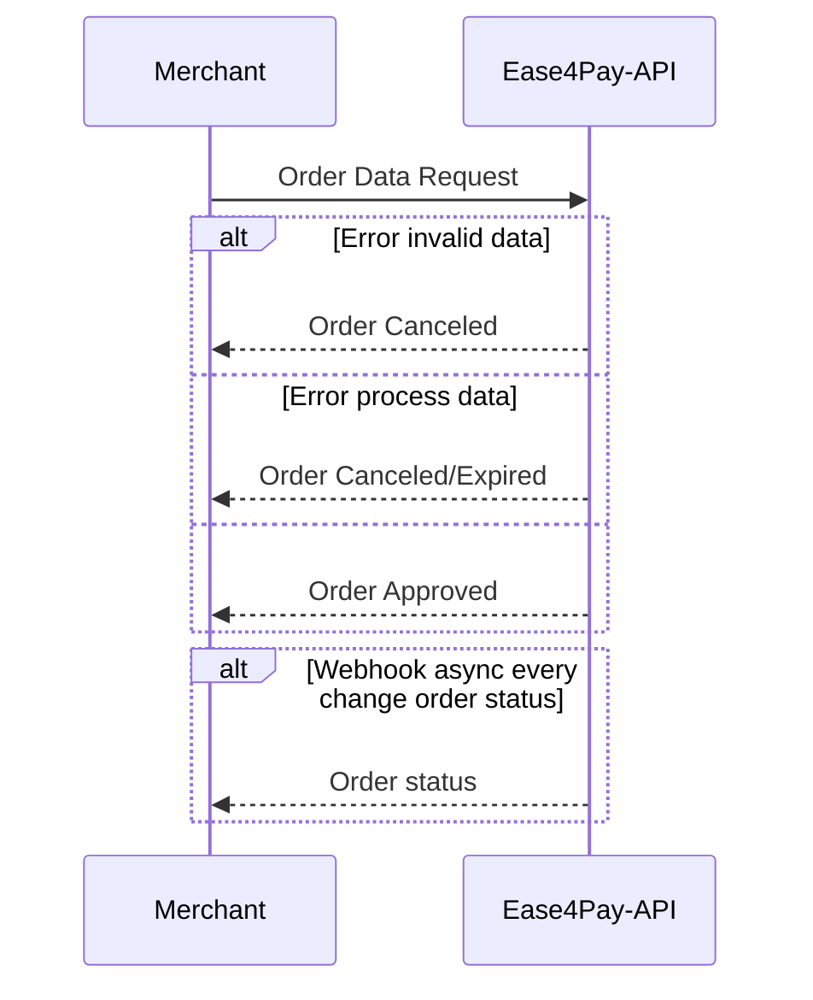

## Welcome to the payment method integration document for Ease4pay.

## 1- API

The API provides a single endpoint for sending the necessary information for processing the payment. 

We refer to the order as a Payment Order. From now on, we will always refer to the set of payment request data as an Order.

### 1.1- Life Cycle of a Payment Order

From the moment the Merchant system sends a request to the Ease4pay API, the processing cycle is initiated.

This cycle may contain 3 phases, following the Order states as the data validations and processing occur:

1-New
2-Pending
3-Approved/Canceled/Expired

The life cycle has only one direction, so a Payment Order never returns to a previous state. For example: 

A request for an Order as soon as it reaches the API receives the status of NEW. Once the payment is processed successfully, it changes to the APPROVED state.

Once an ORDER advances through the cycles, it cannot return to a previous state.

A Order APROVED/CANCELED/EXPIRED, which are the possible states in the final stage of the life cycle, will never return to NEW.



## 2- Sending a request

### 2.1- Get the integration data

Every request must be signed with the unique and non-transferable integration data of the account making the request. These data can be obtained in the administrative system in the "Integration" menu.

Once you have the data, simply add them to the request body as per the list of parameters.

## 2.2- Required fields for the request payload

| Parameters |  Required |   Type                        | Description                                                                                                                                                                                                                    |
| ------------------------------ | ---------------  |   ------------ | ---------------------------------------------------------------------------------------------------------------------------------------------------------------------------------------------------------------------------- |
| amount                         |  Yes | integer                     | Order Total Value in cents (base 100). Ex: R$55.20 = 5520                                                                                                           |
| currency                       |  Yes | string                      | Currency. Accepted values:<br> "BRL"= Brazilian Real<br> "USD" = US Dólar                                                                                                                                       |
| type_id                        |  Yes | integer                     | Order Type. Valid types:<br> 1-Deposit PIX<br>                          |  Yes |
| merchant                       |  Yes | object                      | Merchant data referring to the Order                                                                                                                        |
| merchant.order_id              |  Yes | string                      | Unique Identifier of the Order in the Merchant system. Required for auditing between systems.                                                                |
| merchant.auto_approve          |  Yes (only for Withdrawal) | boolean                     | Pre-approval for the release of withdrawal from account balance. For deposit operations with deposit nature, it is not applicable and must be sent with a default value of FALSE. Only applicable for withdrawal operations (in development). |
| customer                       |  Yes | object                      | Customer data pertaining to the Order.                                                                                                                    |
| customer.email                 |  Yes | string                      | User email                                                                                                                                                                                                             |
| customer.document              |  Yes | string                      | User document. Only CPF type.                                                                                                                                                                              |
| customer.brith_date            |  Yes | string date format yy/mm/DD | User birthday                                                                                                                                                                                               |
| customer.pix_key               |  Yes (only for Withdrawal) | string                      | User's Pix Key that will receive the payment. Required only for Orders of type Pix Withdrawal.                                                                                 |

### 2.3- Generate the Order with signature

Example of a request in JavaScript for Deposit Pix Order:

- FIRST STEP

Obtain Bearer Token with login.

The bearer token has an expiration time of 15 minutes.

endpoint: "https://api.sandbox.ease4pay.com/api/merchants/auth/login"

```
 const userLogin = {
    email:"johndoe@mail.com",
    password:"password12345"
  };

 const configs = {
    method: "POST",
    body: JSON.stringify(userLogin),
    headers: {
      'Accept': 'application/json',
      'Content-Type': 'application/json'
    }
  };

  const url = "https://api.sandbox.ease4pay.com/api/merchants/auth/login";

  const response = await fetch(url, configs)
  .then(res => res.json());

  const bearerToken = response.data.token;
```

- SECOND STEP

Obtain integrations data

For security reasons, we suggest that the integration data is updated periodically.
Every new request to this endpoint renews the data.

endpoint: "https://api.sandbox.ease4pay.com/api/merchants/accounts/integrations"

```
 const configs = {
    method: "POST",
    headers: {
      'Accept': 'application/json',
      'Content-Type': 'application/json'
      'Authorization': 'bearerToken'
    }
  };

 const integrationUrl = "https://api.sandbox.ease4pay.com/api/merchants/accounts/integrations";

  const responseIntegration = await fetch(integrationUrl, configs)
  .then(res => res.json());

  const secret_token = responseIntegration.data.secret_token;
  const secret_key = responseIntegration.data.secret_key;

```

- THIRD STEP

Generate signature data

endpoint: https://api.sandbox.ease4pay.com/api/merchants/accounts/orders/generate-signature

```
  const payload = {
    amount: 2500,
    currency: "USD",
    type_id: 1,
    merchant: {
       order_id: "395b29baak4-3d0-48as6a-bd2a5-08ea000sd8a5c71-ed34",
       auto_approve: false
    },
    customer: {
       email: "customer.test@malinator.com",
       document: "19753725736",
       birth_date: "200-03-02",
       pix_key: "",
       pix_key_type: ""
    }
  };

  const payloadEncoded = JSON.stringify(payload, null, 2);

  const dataEncoded = JSON.stringify({
    payload: payloadEncoded.toString(),
    token: secret_token,
    key: secret_key
  });

  const configs = {
    method: "POST",
    body: dataEncoded,
    headers: {
      'Accept': 'application/json',
      'Content-Type': 'application/json',
      'Authorization': 'bearerToken' 
    }
  };

  const signatureUrl = "https://api.sandbox.ease4pay.com/api/merchants/accounts/orders/generate-signature";

  const responseSignature = await fetch(signatureUrl, configs)
  .then(res => res.json());

  const encrypted = responseSignature.data.encrypted;

```

- FOURTH STEP

Generate Order

endpoint: "https://api.sandbox.ease4pay.com/api/merchants/accounts/orders"

```
  const configs = {
    method: "POST",
    body: payloadEncoded,
    headers: {
      'Accept': 'application/json',
      'Content-Type': 'application/json',
      'Authorization': 'bearerToken',
      'signature-token': encrypted 
    }
  };

  const orderUrl = "https://api.sandbox.ease4pay.com/api/merchants/accounts/orders";

  const responseOrder = await fetch(orderUrl, configs)
  .then(res => res.json());

  const createdOrder = responseOrder.data;

  <...Your Code...>

```

### 3 - Http Errors
| HTTP status |  Code | Message |
| ------------------------------ | ---------------  |   ------------ 
| 406 |  1000401 | No balance for currency!
| 406 |  1000402 | Order rejected due to insufficient balance!
| 406 |  1000403 | Order already exists! order_merchant_id must be unique!
| 406 |  1000404 | Payment method not allowed!
| 406 |  1000405 | Currency not allowed!


### 4 - Reasons for Failure
| Code | Message |
| --------------- | ------------ |
| 2000401 | Order rejected because the document user irregular!
| 2000402 | Order rejected because the user is underage!
| 2000403 | Payment does not accept payments from other users

### 5 - Integration data
- Username and password: After contacting our commercial sector, request access data for the sandbox environment.
- Administrative System sandbox environment for integration testing: https://client.sandbox.ease4pay.com/
- API Sandbox environment for integration testing: https://api.sandbox.ease4pay.com/

### Considerations
Administrative details about custody of values, service fees, balance settlement operations and deadlines are described in the service provision contract.

Access in production depends on integration approval with our quality team.