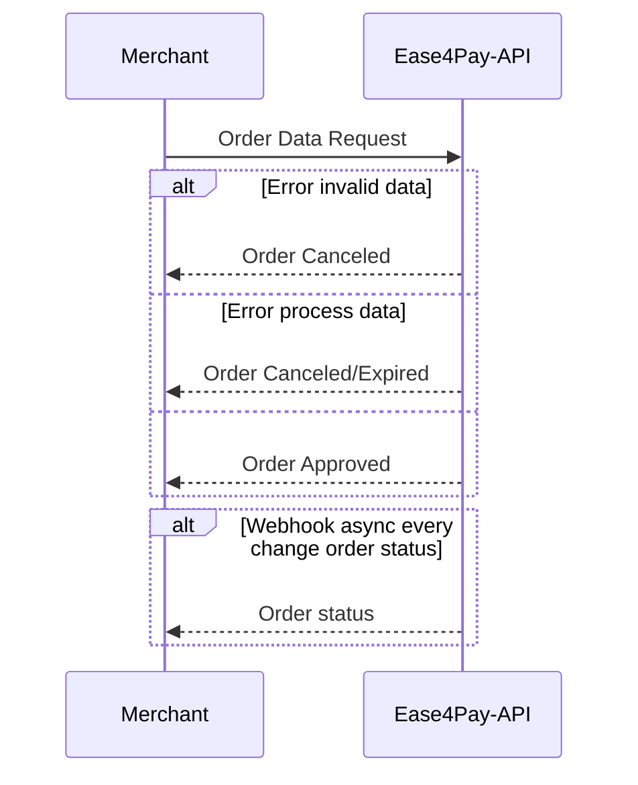

## Welcome to the payment method integration document for Ease4pay.

## 1- API

The API provides a single endpoint for sending the necessary information for processing the payment. 

We refer to the order as a Payment Order. From now on, we will always refer to the set of payment request data as an Order.

### 1.1- Life Cycle of a Payment Order

From the moment the Merchant system sends a request to the Ease4pay API, the processing cycle is initiated.

This cycle may contain 3 phases, following the Order states as the data validations and processing occur:

1-New
2-Pending
3-Approved/Canceled/Expired

The life cycle has only one direction, so a Payment Order never returns to a previous state. For example: 

A request for an Order as soon as it reaches the API receives the status of NEW. Once the payment is processed successfully, it changes to the APPROVED state.

Once an ORDER advances through the cycles, it cannot return to a previous state.

A Order APROVED/CANCELED/EXPIRED, which are the possible states in the final stage of the life cycle, will never return to NEW.



## 2- Sending a request

### 2.1- Get the integration data

Every request must be signed with the unique and non-transferable integration data of the account making the request. These data can be obtained in the administrative system in the "Integration" menu.

Once you have the data, simply add them to the request body as per the list of parameters.

## 2.2- Required fields for the request payload

| Parameters |  Required |   Type                        | Description                                                                                                                                                                                                                    |
| ------------------------------ | ---------------  |   ------------ | ---------------------------------------------------------------------------------------------------------------------------------------------------------------------------------------------------------------------------- |
| amount                         |  Yes | integer                     | Order Total Value in cents (base 100). Ex: R$55.20 = 5520                                                                                                           |
| currency                       |  Yes | string                      | Currency. Accepted values:<br> "BRL"= Brazilian Real<br> "USD" = US Dólar                                                                                                                                       |
| type_id                        |  Yes | integer                     | Order Type. Valid types:<br> 1-Deposit PIX<br>                          |  Yes |
| merchant                       |  Yes | object                      | Merchant data referring to the Order                                                                                                                        |
| merchant.order_id              |  Yes | string                      | Unique Identifier of the Order in the Merchant system. Required for auditing between systems.                                                                |
| merchant.webhook_url           |  Yes | string                      | Url where webhooks will be sent.                                                                                                                         |
| merchant.auto_approve          |  Yes | boolean                     | Pre-approval for the release of withdrawal from account balance. For deposit operations with deposit nature, it is not applicable and must be sent with a default value of FALSE. Only applicable for withdrawal operations (in development). |
| customer                       |  Yes | object                      | Customer data pertaining to the Order.                                                                                                                    |
| customer.email                 |  Yes | string                      | User email                                                                                                                                                                                                             |
| customer.document              |  Yes | string                      | User document. Only CPF type.                                                                                                                                                                              |
| customer.brith_date            |  Yes | string date format yy/mm/DD | User birthday                                                                                                                                                                                               |
| customer.pix_key               |  No | string                      | User's Pix Key that will receive the payment. Required only for Orders of type Pix Withdrawal.                                                                                 |

### 2.2- Generate the Order with signature

endpoint: https://api.ease4pay.com/api/merchants/accounts/orders

Example of the required data to create the Order request:

```
// -----  Data obtained from the administrative panel -----
const secret_token= "2831uwh21892u";

const secret_key= "shSHGjahsjasue1201";
// --------------------------------------------------

// -----  Order data ----------------------------
const payload = {
   "amount": 2500,
   "currency": "BRL",
   "type_id": 1,
   "merchant": {
       "order_id": "395b29baak4-3d0-48as6a-bd2a5-08ea000sd8a5c71-ed34",
       "webhook_url": "https://webhook.site/1c4bc91e-fb25-4223-889f-2236403a0999",
       "auto_approve": false
   },
   "customer": {
       "email": "customer.test@malinator.com",
       "document": "19753725736",
       "birth_date": "200-03-02",
       "pix_key": "kosd89ddpdsiop9-"
   }
};
// --------------------------------------------------
```

Example of a request in JavaScript:

```
const response = await fetch("https://api.ease4pay.com/api/merchants/accounts/orders", {
  method: "POST",
  body: JSON.stringify(
        {
            “payload”: JSON.stringfy(payload),
            "token“: api_token,
            “secret”: secret_token
        }
    ),
  headers: {
  	"Content-Type": "application/json",
  }
  ...<code>
)
});
```

### Considerations

Administrative details regarding value custody, service fees, settlement operations, and deadlines are described in the service agreement contract.
