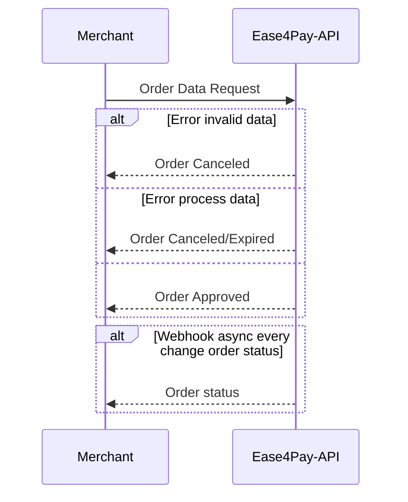

## Seja bem vindo ao documento de integração dos métodos de pagamento da Ease4pay.

## 1- API

A API fornece um único endpoint para o envio das informações necessárias para o processamento do pagamento.

Denominamos o pedido como sendo uma Ordem de pagamento. Portanto, apartir de agora, sempre iremos nos referir como Ordem para o conjunto de dados de um pedido de pagamento.

### 1.1- Ciclo de vida de uma Ordem

Apartir do momento que o sistema do Comerciante envia uma requisição para o da API Ease4pay é iniciado o ciclo de processamento.

Este ciclo pode conter 3 fases seguindo estados da Ordem conforme as validações dos dados e o processamento ocorrerem:

1-Novo
2-Pendente
3-Aprovado/Cancelado/Expirado

O ciclo de vida possuí um único sentido, sendo assim, uma Ordem nunca retorna para o estado anterior. Exemplo:

Uma requisição de Ordem assim que chega na API recebe o estado de NOVO. Assim que o pagamento foi processado com êxito ela muda para o estado de APROVADA.

Uma vez que a ORDEM avança nos ciclos ela não pode retornar a um estado anterior.

Uma ordem APROVADA/CANCELADA/EXPIRADA, que são os estados possíveis no último estágio do ciclo de vida, jamais retornará para NOVO.



## 2- Enviando uma requisição

### 2.1- Obter os dados de integração

Toda requisição deve ser assinada pelos dados de integração, únicos e intransferíveis, da conta que realiza a requisição.
Os dados podem ser obtidos no sistema administrativo no menu "Integração".

Uma vez de posse dos dados, basta adicioná-los ao Body da requisição conforme a lista de parâmetros.

## 2.2- Dados obrigatórios para o payload da requisição

| Parâmetros |  Obrigatório |   Tipo                        | Descrição                                                                                                                                                                                                                    |
| ------------------------------ | ---------------  |   ------------ | ---------------------------------------------------------------------------------------------------------------------------------------------------------------------------------------------------------------------------- |
| amount                         |  Sim | integer                     | Valor total da Ordem em base 100. Ex: R$55,20 = 5520                                                                                                                                                                         |
| currency                        |  Sim | string                      | Moeda corrente. Valores aceitos:<br> "BRL"= Real brasileiro<br> "USD" = Dólar americano                                                                                                                                      |
| type_id                         |  Sim | integer                     | Tipo da Ordem. Tipos válidos:<br> 1-Depósito PIX<br>                              |
| merchant                        |  Sim | object                      | Dados do Comerciante referentes a Ordem                                                                                                                                                                                      |
| merchant.order_id               |  Sim | string                      | Identificador ÚNICO da Ordem no sistema do Comerciante. Necessário para auditoria entre sistemas.                                                                                                                            |
| merchant.webhook_url            |  Sim | string                      | Url para onde serão enviados os webhooks.                                                                                                                                                                                    |
| merchant.auto_approve           |  Sim | boolean                     | Pré-aprovação para liberação de saque do saldo de conta.<br> Para operações com natureza de depósito NÃO é aplicavél, deve ser enviado como padrão com valor FALSE. Só aplicável para operações de saque(em desenvolvimento) |
| customer                        |  Sim | object                      | Dados do usuário final participante da Ordem.                                                                                                                                                                                |
| customer.email                  |  Sim | string                      | Email do usuário                                                                                                                                                                                                             |
| customer.document               |  Sim | string                      | Documento do usuário. Somente tipo CPF é válido                                                                                                                                                                              |
| customer.brith_date             |  Sim | string date format yy/mm/DD | Data de aniversário do usuário                                                                                                                                                                                               |
| customer.pix_key                |  Não | string                      | Chave Pix do usuário que irá receber o pagamento. Obrigatório somente nas Ordens do tipo Saque Pix.                                                                                                                                            |

### 2.2- Gerar a ordem com assinatura

endpoint: https://api.ease4pay.com/api/merchants/accounts/orders

Exemplo dos dados obrigatórios para criar a requisição da Ordem:

```
// -----  Dados obtidos no painel administrativo -----
const secret_token= "2831uwh21892u";

const secret_key= "shSHGjahsjasue1201";
// --------------------------------------------------

// -----  Dados da Ordem ----------------------------
const payload = {
   "amount": 2500,
   "currency": "BRL",
   "type_id": 1,
   "merchant": {
       "order_id": "395b29baak4-3d0-48as6a-bd2a5-08ea000sd8a5c71-ed34",
       "webhook_url": "https://webhook.site/1c4bc91e-fb25-4223-889f-2236403a0999",
       "auto_approve": false
   },
   "customer": {
       "email": "customer.test@malinator.com",
       "document": "19753725736",
       "birth_date": "200-03-02",
       "pix_key": "kosd89ddpdsiop9-"
   }
};
// --------------------------------------------------
```

Exemplo de requisição em JavaScript:

```
const response = await fetch("https://api.ease4pay.com/api/merchants/accounts/orders", {
  method: "POST",
  body: JSON.stringify(
        {
            “payload”: JSON.stringfy(payload),
            "token“: secret_token,
            “secret”: secret_key
        }
    ),
  headers: {
  	"Content-Type": "application/json",
  }
  ...<code>
)
});
```

### Considerações

Detalhes administrativos sobre custódia de valores, taxas de serviço, operações de liquidação de saldo e prazos estão descritos no contrato de prestação de serviço.
