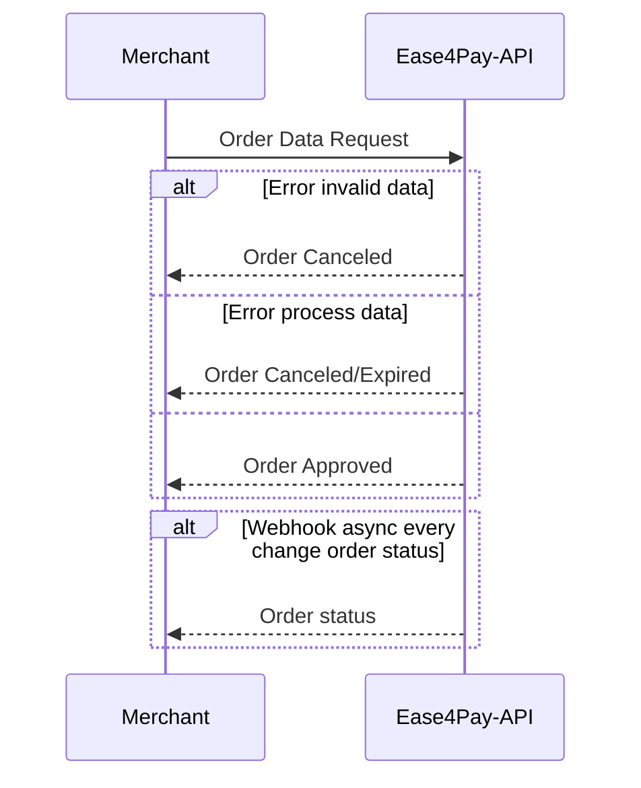

## Seja bem vindo ao documento de integração dos métodos de pagamento da Ease4pay.

## 1- API

A API fornece um único endpoint para o envio das informações necessárias para o processamento do pagamento.

Denominamos o pedido como sendo uma Ordem de pagamento. Portanto, apartir de agora, sempre iremos nos referir como Ordem para o conjunto de dados de um pedido de pagamento.

### 1.1- Ciclo de vida de uma Ordem

Apartir do momento que o sistema do Comerciante envia uma requisição para o da API Ease4pay é iniciado o ciclo de processamento.

Este ciclo pode conter 3 fases seguindo estados da Ordem conforme as validações dos dados e o processamento ocorrerem:

1-Novo
2-Pendente
3-Aprovado/Cancelado/Expirado

O ciclo de vida possuí um único sentido, sendo assim, uma Ordem nunca retorna para o estado anterior. Exemplo:

Uma requisição de Ordem assim que chega na API recebe o estado de NOVO. Assim que o pagamento foi processado com êxito ela muda para o estado de APROVADA.

Uma vez que a ORDEM avança nos ciclos ela não pode retornar a um estado anterior.

Uma ordem APROVADA/CANCELADA/EXPIRADA, que são os estados possíveis no último estágio do ciclo de vida, jamais retornará para NOVO.



## 2- Enviando uma requisição

### 2.1- Obter os dados de integração

Toda requisição deve ser assinada pelos dados de integração, únicos e intransferíveis, da conta que realiza a requisição.
Os dados podem ser obtidos no sistema administrativo no menu "Integração".

Uma vez de posse dos dados, basta adicioná-los ao Body da requisição conforme a lista de parâmetros.

## 2.2- Dados obrigatórios para o payload da requisição

| Parâmetros |  Obrigatório |   Tipo                        | Descrição                                                                                                                                                                                                                    |
| ------------------------------ | ---------------  |   ------------ | ---------------------------------------------------------------------------------------------------------------------------------------------------------------------------------------------------------------------------- |
| amount                         |  Sim | integer                     | Valor total da Ordem em base 100. Ex: R$55,20 = 5520                                                                                                                                                                         |
| currency                        |  Sim | string                      | Moeda corrente. Valores aceitos:<br> "BRL"= Real brasileiro<br> "USD" = Dólar americano                                                                                                                                      |
| type_id                         |  Sim | integer                     | Tipo da Ordem. Tipos válidos:<br> 1-Depósito PIX<br>                              |
| merchant                        |  Sim | object                      | Dados do Comerciante referentes a Ordem                                                                                                                                                                                      |
| merchant.order_id               |  Sim | string                      | Identificador ÚNICO da Ordem no sistema do Comerciante. Necessário para auditoria entre sistemas.                                                                                                                            |
| merchant.webhook_url            |  Sim | string                      | Url para onde serão enviados os webhooks.                                                                                                                                                                                    |
| merchant.auto_approve           |  Sim | boolean                     | Pré-aprovação para liberação de saque do saldo de conta.<br> Para operações com natureza de depósito NÃO é aplicavél, deve ser enviado como padrão com valor FALSE. Só aplicável para operações de saque(em desenvolvimento) |
| customer                        |  Sim | object                      | Dados do usuário final participante da Ordem.                                                                                                                                                                                |
| customer.email                  |  Sim | string                      | Email do usuário                                                                                                                                                                                                             |
| customer.document               |  Sim | string                      | Documento do usuário. Somente tipo CPF é válido                                                                                                                                                                              |
| customer.brith_date             |  Sim | string date format yy/mm/DD | Data de aniversário do usuário                                                                                                                                                                                               |
| customer.pix_key                |  Sim (somente para saque pix) | string                      | Chave Pix do usuário que irá receber o pagamento. Obrigatório somente nas Ordens do tipo Saque Pix.      
| customer.pix_key_type               |  Sim (somente para saque pix) | string                      |Tipo de chave Pix do usuário. Obrigatório apenas para Pedidos do tipo Saque Pix. Valores aceitos:<br> "cpf"= Documento do usuário<br> "phone"= Telefone do usuário. Registrado no sistema PIX. Pode ser diferente do registrado no cadastro do usuário.<br>"email"= Email do usuário. Registrado no sistema PIX. Pode ser diferente do registrado no cadastro do usuário.<br>"random_key"= Chave aleatória                                                                                                                                        |

### 2.3- Generate the Order with signature

Exemplo de requesição em JavaScript para Ordem de Depósito Pix:

- PRIMEIRO PASSO

Obtenha o Bearer Token no endpoint de Login.

O bearer token possui tempo de expiração de 15min.

endpoint: "https://api.sandbox.ease4pay.com/api/merchants/auth/login"

```
 const userLogin = {
    email:"johndoe@mail.com",
    password:"password12345"
  };

 const configs = {
    method: "POST",
    body: JSON.stringify(userLogin),
    headers: {
      'Accept': 'application/json',
      'Content-Type': 'application/json'
    }
  };

  const url = "https://api.sandbox.ease4pay.com/api/merchants/auth/login";

  const response = await fetch(url, configs)
  .then(res => res.json());

  const bearerToken = response.data.token;
```

- SEGUNDO PASSO

Obtenha os dados de integração

Por questões de segurança, sugerimos que os dados de integração sejam atualizados periodicamente.
Toda nova requisição para este endpoint renova os dados.

endpoint: "https://api.sandbox.ease4pay.com/api/merchants/accounts/integrations"

```
 const configs = {
    method: "POST",
    headers: {
      'Accept': 'application/json',
      'Content-Type': 'application/json'
      'Authorization': 'bearerToken'
    }
  };

  const integrationUrl = "https://api.sandbox.ease4pay.com/api/merchants/accounts/integrations";

  const responseIntegration = await fetch(integrationUrl, configs)
  .then(res => res.json());

  const secret_token = responseIntegration.data.secret_token;
  const secret_key = responseIntegration.data.secret_key;

```

- TERCEIRO PASSO

Gere a assinatura da ordem.

endpoint: https://api.sandbox.ease4pay.com/api/merchants/accounts/orders/generate-signature

```
  const payload = {
    amount: 2500,
    currency: "USD",
    type_id: 1,
    merchant: {
       order_id: "395b29baak4-3d0-48as6a-bd2a5-08ea000sd8a5c71-ed34",
       auto_approve: false
    },
    customer: {
       email: "customer.test@malinator.com",
       document: "19753725736",
       birth_date: "200-03-02",
       pix_key: "",
       pix_key_type: ""
    }
  };

  const payloadEncoded = JSON.stringify(payload, null, 2);

  const dataEncoded = JSON.stringify({
    payload: payloadEncoded.toString(),
    token: secret_token,
    key: secret_key
  });

  const configs = {
    method: "POST",
    body: dataEncoded,
    headers: {
      'Accept': 'application/json',
      'Content-Type': 'application/json',
      'Authorization': 'bearerToken' 
    }
  };

  const signatureUrl = "https://api.sandbox.ease4pay.com/api/merchants/accounts/orders/generate-signature";

  const responseSignature = await fetch(signatureUrl, configs)
  .then(res => res.json());

  const encrypted = responseSignature.data.encrypted;

```

- QUARTO PASSO

Crie a ordem.

endpoint: "https://api.sandbox.ease4pay.com/api/merchants/accounts/orders"

```
  const configs = {
    method: "POST",
    body: payloadEncoded,
    headers: {
      'Accept': 'application/json',
      'Content-Type': 'application/json',
      'Authorization': 'bearerToken',
      'signature-token': encrypted 
    }
  };

  const orderUrl = "https://api.sandbox.ease4pay.com/api/merchants/accounts/orders";

  const responseOrder = await fetch(orderUrl, configs)
  .then(res => res.json());

  const createdOrder = responseOrder.data;

  <...Your Code...>

```


### 3 - Erros Http
| HTTP status |  Code | Message |
| ------------------------------ | ---------------  |   ------------ 
| 406 |  1000401 | No balance for currency!
| 406 |  1000402 | Order rejected due to insufficient balance!
| 406 |  1000403 | Order already exists! order_merchant_id must be unique!
| 406 |  1000404 | Payment method not allowed!
| 406 |  1000405 | Currency not allowed!

### 4 - Motivos de falha
| Code | Message |
| --------------- | ------------ |
| 2000401 | Order rejected because the document user irregular!
| 2000402 | Order rejected because the user is underage!
| 2000403 | Payment does not accept payments from other users

### 5 - Dados de integração
- Usuário e senha: Após realizar contato com nosso setor comercial, requisite os dados de acesso para o ambiente sandbox.
- Sistema Administrativo ambiente sandbox para testes de integração: https://client.sandbox.ease4pay.com/
- API ambiente Sandbox para testes de integração: https://api.sandbox.ease4pay.com/

### Considerações
Detalhes administrativos sobre custódia de valores, taxas de serviço, operações de liquidação de saldo e prazos estão descritos no contrato de prestação de serviço.

Acessos em produção dependem de homologação de integração junto à nossa equipe de qualidade.
